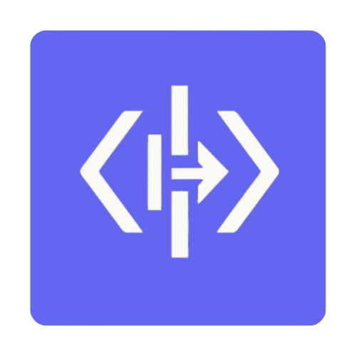
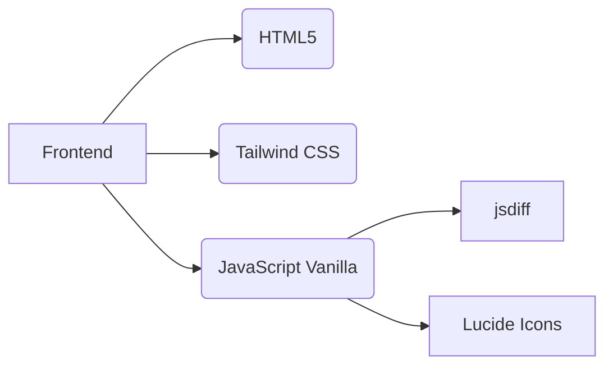

# CodeDiff Pro 🚀  

  

**Uma ferramenta moderna para comparação de códigos com destaque visual de diferenças**  

## 🔍 Visão Geral  
O CodeDiff Pro é uma ferramenta online que permite comparar dois trechos de código de forma intuitiva, destacando visualmente adições, remoções e alterações. Ideal para desenvolvedores que precisam analisar mudanças em algoritmos, revisar pull requests ou entender modificações em bases de código.  

[](https://github.com/Inojoza28/codediff/blob/main/LICENSE)  
[](https://github.com/Inojoza28/codediff/)  

## ✨ Funcionalidades  
- **Diferenciação Inteligente**  
  Identifica adições (`+`), remoções (`-`) e linhas inalteradas  
- **Modo Ignorar Espaços**  
  Opção para desconsiderar diferenças de indentação e espaçamento  
- **Estatísticas Detalhadas**  
  Exibe contagem de adições/remoções em tempo real  
- **UX Otimizado**  
  - Arraste e solte arquivos  
  - Copiar código com feedback visual  
  - Atalhos de teclado (`Ctrl+Enter` para comparar)  
  - Design responsivo e tema escuro  
- **Acessibilidade**  
  Compatível com leitores de tela e navegação por teclado  

## 🛠️ Tecnologias  


## 🚀 Como Usar  
1. **Acesso online**:  
   [https://inojoza28.github.io/codediff](https://inojoza28.github.io/codediff)  

2. **Localmente**:  
```bash
git clone https://github.com/Inojoza28/codediff.git
cd codediff
# Não requer instalação! Basta abrir o index.html
```


## 🛑 Limitações Conhecidas  
- Arquivos muito grandes (>10k linhas) podem impactar performance  
- Destaque sintático limitado (não reconhece linguagens específicas)  
- Não suporta comparação binária de arquivos  


## ✉️ Contato  
**Gabriel Inojoza**  
- [GitHub](https://github.com/Inojoza28)  
- [Instagram](https://www.instagram.com/dev_inojoza_/)  
- [LinkedIn](https://www.linkedin.com/in/gabriel-inojoza/)  

---

> “Uma ferramenta essencial para quem trabalha com evolução de código diariamente!” - *Revisor Anônimo*
